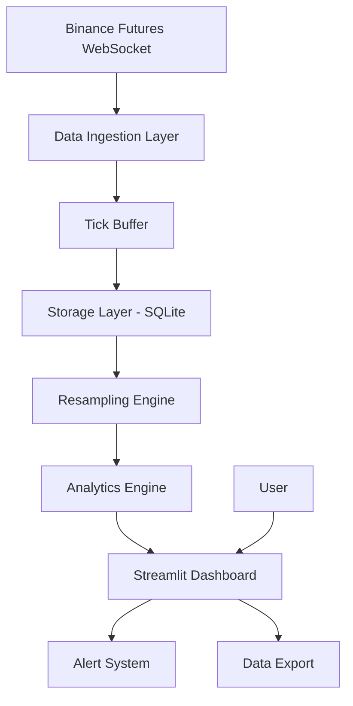
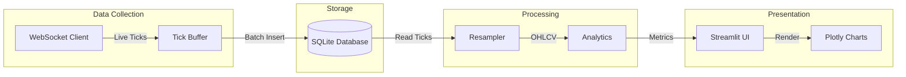
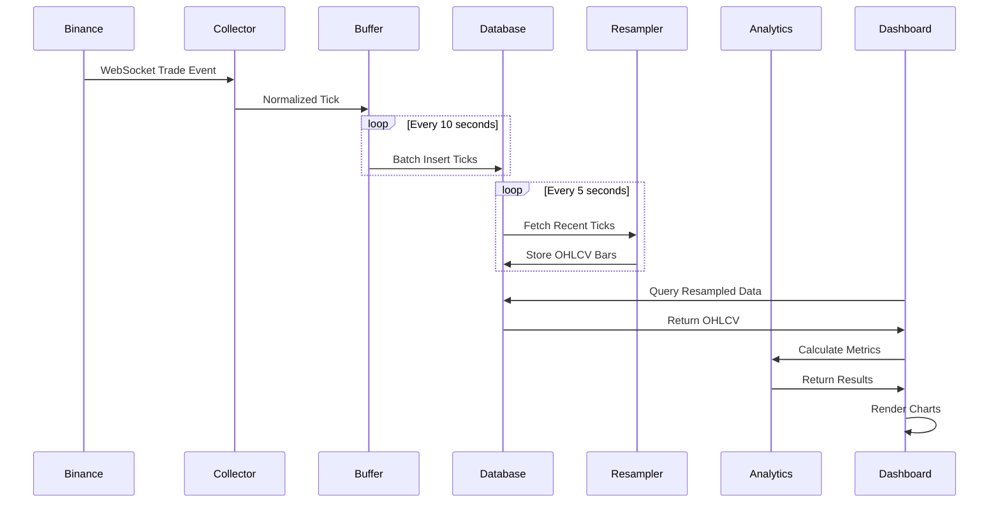
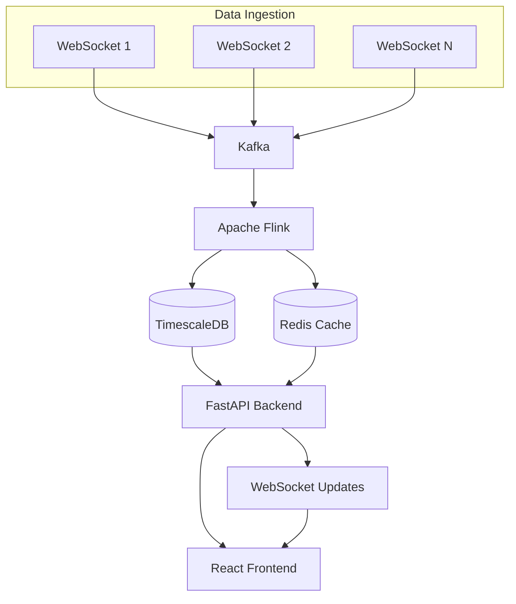
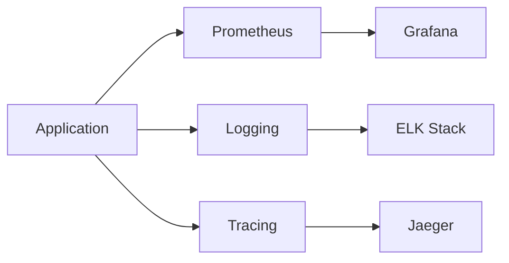

# System Architecture

## High-Level Architecture Diagram



## Detailed Component Architecture



## Data Flow



## Module Structure

```
src/
├── data_ingestion.py
│   ├── BinanceWSCollector
│   │   ├── _subscribe_symbol()
│   │   ├── normalize_tick()
│   │   └── start() / stop()
│   └── TickBuffer
│       ├── add()
│       ├── get_all()
│       └── clear()
│
├── storage.py
│   └── DataStore
│       ├── insert_tick()
│       ├── insert_ticks_batch()
│       ├── get_ticks()
│       ├── insert_resampled()
│       ├── get_resampled()
│       └── log_alert()
│
├── resampler.py
│   ├── DataResampler
│   │   ├── resample_ticks()
│   │   └── get_latest_bars()
│   └── RollingCalculator
│       ├── rolling_mean()
│       ├── rolling_std()
│       └── rolling_correlation()
│
├── analytics.py
│   └── PairsAnalytics
│       ├── calculate_hedge_ratio_ols()
│       ├── calculate_spread()
│       ├── calculate_z_score()
│       ├── calculate_correlation()
│       ├── adf_test()
│       └── calculate_half_life()
│
└── pipeline.py
    └── MarketDataPipeline
        ├── start()
        ├── stop()
        ├── get_resampled_data()
        └── calculate_pairs_analytics()
```

## Technology Stack

| Layer | Technology | Purpose |
|-------|-----------|---------|
| **Frontend** | Streamlit | Interactive web UI |
| **Visualization** | Plotly | Real-time charts |
| **Data Processing** | Pandas | Time series manipulation |
| **Statistics** | NumPy, SciPy, Statsmodels | Numerical computing |
| **Storage** | SQLite | Persistent data |
| **Async I/O** | asyncio, websockets | Live data collection |

## Database Schema

### Table: `ticks`
```sql
CREATE TABLE ticks (
    id INTEGER PRIMARY KEY,
    timestamp DATETIME NOT NULL,
    symbol TEXT NOT NULL,
    price REAL NOT NULL,
    size REAL NOT NULL,
    is_buyer_maker INTEGER
);

CREATE INDEX idx_symbol_timestamp ON ticks(symbol, timestamp);
```

### Table: `resampled`
```sql
CREATE TABLE resampled (
    id INTEGER PRIMARY KEY,
    timestamp DATETIME NOT NULL,
    symbol TEXT NOT NULL,
    timeframe TEXT NOT NULL,
    open REAL NOT NULL,
    high REAL NOT NULL,
    low REAL NOT NULL,
    close REAL NOT NULL,
    volume REAL NOT NULL,
    trade_count INTEGER,
    UNIQUE(symbol, timeframe, timestamp)
);

CREATE INDEX idx_resampled_lookup ON resampled(symbol, timeframe, timestamp);
```

### Table: `alerts`
```sql
CREATE TABLE alerts (
    id INTEGER PRIMARY KEY,
    timestamp DATETIME NOT NULL,
    alert_type TEXT NOT NULL,
    symbol TEXT,
    message TEXT NOT NULL,
    value REAL,
    threshold REAL
);
```

## Analytics Pipeline

```mermaid
graph TD
    A[Price Series A & B] --> B[OLS Regression]
    B --> C[Hedge Ratio β]
    C --> D[Calculate Spread]
    D --> E[Rolling Mean & Std]
    E --> F[Z-Score]
    F --> G{|Z| > Threshold?}
    G -->|Yes| H[Trigger Alert]
    G -->|No| I[Continue Monitoring]
    
    A --> J[Rolling Correlation]
    D --> K[ADF Test]
    K --> L{Stationary?}
    L -->|Yes| M[Good for Trading]
    L -->|No| N[Poor Pair]
```

## Scaling Architecture (Production)



## Performance Considerations

### Current System (Single Machine)
- **Latency**: ~500ms tick-to-chart
- **Throughput**: ~1000 ticks/second
- **Storage**: Limited by disk I/O
- **Scalability**: Vertical only

### Bottlenecks
1. **SQLite Write Locks**: Single writer at a time
2. **Pandas Memory**: Entire dataset in RAM
3. **Streamlit Refresh**: Full page reload
4. **Synchronous Processing**: Blocks on calculations

### Production Improvements

| Component | Current | Production | Benefit |
|-----------|---------|-----------|---------|
| Ingestion | Single thread | Kafka cluster | Distributed, fault-tolerant |
| Storage | SQLite | TimescaleDB | Time-series optimized |
| Processing | Pandas batch | Flink streaming | Real-time aggregation |
| Cache | None | Redis | Sub-millisecond reads |
| API | Streamlit | FastAPI + WebSocket | True real-time push |
| Frontend | Streamlit | React SPA | Smooth updates, no reload |

## Security Considerations

### Current Implementation
- ✅ Read-only WebSocket connection
- ✅ Local database (no network exposure)
- ✅ No API keys required
- ⚠️ No authentication
- ⚠️ No encryption
- ⚠️ No rate limiting

### Production Requirements
- 🔐 User authentication (OAuth2)
- 🔐 API key management
- 🔐 TLS/SSL encryption
- 🔐 Rate limiting per user
- 🔐 Input validation
- 🔐 SQL injection prevention
- 🔐 CORS policies

## Monitoring & Observability

### Recommended Additions


### Key Metrics to Track
- **Ingestion Rate**: Ticks/second
- **Processing Latency**: Time from tick to chart
- **Database Size**: Growth rate
- **Memory Usage**: Pandas DataFrame size
- **Error Rate**: Failed calculations
- **WebSocket Reconnects**: Connection stability

## Deployment Options

### Option 1: Local Development (Current)
```bash
python -m streamlit run app.py
```
- ✅ Simple
- ✅ Fast iteration
- ❌ Single user
- ❌ Not persistent

### Option 2: Docker Container
```dockerfile
FROM python:3.11-slim
WORKDIR /app
COPY requirements.txt .
RUN pip install -r requirements.txt
COPY . .
CMD ["streamlit", "run", "app.py"]
```
- ✅ Reproducible
- ✅ Portable
- ✅ Easy deployment

### Option 3: Cloud Deployment
- **Streamlit Cloud**: Free tier available
- **Heroku**: Simple deployment
- **AWS/GCP/Azure**: Full control
- **Docker + Kubernetes**: Enterprise scale

## Future Enhancements

### Phase 1: Core Improvements
- [ ] Persistent background worker
- [ ] Historical data backfill
- [ ] Multi-pair portfolio view
- [ ] Performance metrics (Sharpe, drawdown)

### Phase 2: Advanced Analytics
- [ ] Kalman filter hedge ratio
- [ ] VECM cointegration test
- [ ] Machine learning prediction
- [ ] Order book analysis

### Phase 3: Production Ready
- [ ] Migrate to TimescaleDB
- [ ] React frontend
- [ ] WebSocket real-time updates
- [ ] User authentication
- [ ] Backtesting engine

### Phase 4: Enterprise Scale
- [ ] Kafka message broker
- [ ] Apache Flink streaming
- [ ] Microservices architecture
- [ ] Load balancing
- [ ] Multi-region deployment

## References

### Academic Papers
- Gatev, E., Goetzmann, W.N., & Rouwenhorst, K.G. (2006). "Pairs Trading: Performance of a Relative-Value Arbitrage Rule"
- Engle, R.F., & Granger, C.W. (1987). "Co-integration and Error Correction"

### Books
- Chan, E. (2013). "Algorithmic Trading: Winning Strategies and Their Rationale"
- Jansen, S. (2020). "Machine Learning for Algorithmic Trading"

### Tools & Frameworks
- Streamlit: https://streamlit.io/
- Plotly: https://plotly.com/python/
- Statsmodels: https://www.statsmodels.org/
- Binance API: https://binance-docs.github.io/apidocs/

---

*Architecture designed for educational demonstration and production scaling path*
