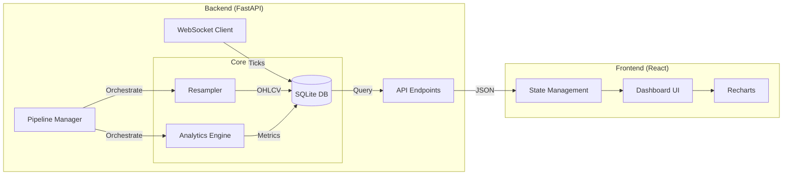
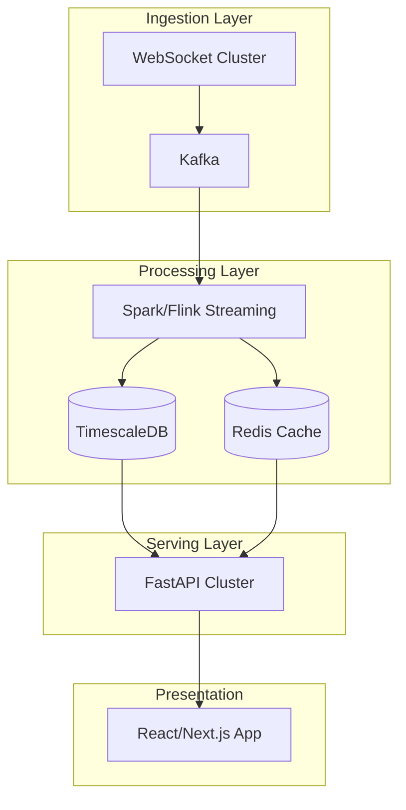

# System Architecture

## High-Level Architecture Diagram

```mermaid
graph TB
    A[Binance Futures WebSocket] --> B[Data Ingestion (FastAPI)]
    U[User Upload CSV] --> B
    B --> C[Tick Buffer / DataStore]
    C --> D[Storage Layer - SQLite (WAL)]
    D --> E[Resampling Engine]
    E --> F[Analytics Engine (Pandas/Statsmodels)]
    F --> G[FastAPI Endpoints]
    
    H[User Browser] --> I[React Frontend (Vite)]
    I -->|HTTP/REST| G
    I -->|Polling/WS| G
    G --> J[Alert System]
```

## Detailed Component Architecture



## Module Structure

```
gemscap/
├── api.py                    # FastAPI Application Entry Point
├── backend_error.log         # Error Logs
├── market_data.db            # SQLite Database (WAL Mode)
├── src/
│   ├── data_ingestion.py     # Binance WebSocket Client
│   ├── storage.py            # SQLite DataStore Implementation
│   ├── resampler.py          # OHLCV Aggregation Logic
│   ├── analytics.py          # Quant Analytics (OLS, Huber, ADF, Z-Score)
│   └── pipeline.py           # Multi-Pipeline Manager
│
└── frontend/                 # React Application
    ├── src/
    │   ├── App.jsx           # Main Dashboard Component
    │   ├── main.jsx          # React Entry Point
    │   └── assets/           # Static Assets
    ├── package.json          # Frontend Dependencies
    └── vite.config.js        # Vite Configuration
```

## Technology Stack

| Layer | Technology | Purpose |
|-------|-----------|---------|
| **Frontend** | React 18, Vite | High-performance SPA with Virtual DOM |
| **Styling** | TailwindCSS | Modern utility-first CSS |
| **Visualization** | Recharts | Responsive, composable charts |
| **Backend** | FastAPI (Python 3.9+) | Async API framework |
| **Data Processing** | Pandas, NumPy | vectorized data manipulation |
| **Statistics** | Statsmodels, SciPy | OLS/Huber regression, ADF tests |
| **Storage** | SQLite (WAL Mode) | High-concurrency local database |
| **Ingestion** | Websockets (Asyncio) | Real-time market data feed |

## Database Schema

### Table: `ticks`
```sql
CREATE TABLE ticks (
    id INTEGER PRIMARY KEY,
    timestamp DATETIME NOT NULL,
    symbol TEXT NOT NULL,
    price REAL NOT NULL,
    size REAL NOT NULL,
    is_buyer_maker INTEGER
);
CREATE INDEX idx_symbol_timestamp ON ticks(symbol, timestamp);
```

### Table: `resampled`
```sql
CREATE TABLE resampled (
    id INTEGER PRIMARY KEY,
    timestamp DATETIME NOT NULL,
    symbol TEXT NOT NULL,
    timeframe TEXT NOT NULL,
    open REAL NOT NULL,
    high REAL NOT NULL,
    low REAL NOT NULL,
    close REAL NOT NULL,
    volume REAL NOT NULL,
    trade_count INTEGER,
    UNIQUE(symbol, timeframe, timestamp)
);
CREATE INDEX idx_resampled_lookup ON resampled(symbol, timeframe, timestamp);
```

### Table: `alerts`
```sql
CREATE TABLE alerts (
    id INTEGER PRIMARY KEY,
    timestamp DATETIME NOT NULL,
    alert_type TEXT NOT NULL,
    symbol TEXT,
    message TEXT NOT NULL,
    value REAL,
    threshold REAL
);
```

## Analytics Pipeline Flow

```mermaid
graph TD
    A[Raw Ticks] --> B[Resampler (1s/1m/5m)]
    B --> C[Align Time Series (A & B)]
    C --> D[Regression (OLS or Huber)]
    D --> E[Calculate Hedge Ratio β]
    E --> F[Calculate Spread = A - β*B]
    F --> G[Rolling Z-Score]
    G --> H{Z > Threshold?}
    H -->|Yes| I[Trigger Alert]
    H -->|No| J[Wait]
    
    C --> K[ADF Stationarity Test]
    C --> L[Half-Life Calculation]
```

## Production Scaling Path



## Security Considerations

### Current Implementation
- **CORS Configured**: API restricts access to trusted frontend origins.
- **Input Sanitation**: NumPy types converted to native Python types to prevent JSON serialization attacks/crashes.
- **Local Isolation**: Database is file-based and not exposed to the internet.

### Future Requirements
- **JWT Authentication**: Secure user sessions.
- **Rate Limiting**: Prevent API abuse.
- **HTTPS**: Encrypt transport layer.

## Deployment Options

### Option 1: Development (Current)
- Backend: `uvicorn api:app --reload`
- Frontend: `npm run dev`

### Option 2: Docker Composition
```yaml
services:
  backend:
    build: .
    command: uvicorn api:app --host 0.0.0.0
  frontend:
    build: ./frontend
    command: serve -s build
```

## References
- **FastAPI**: https://fastapi.tiangolo.com/
- **React**: https://react.dev/
- **Statsmodels (Robust Regression)**: https://www.statsmodels.org/stable/rlm.html
